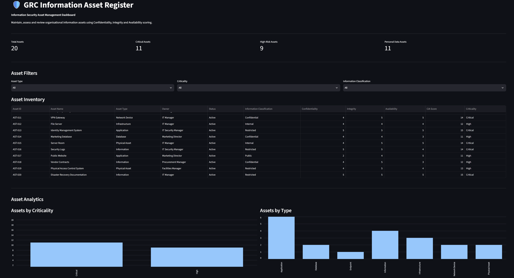

# GRC Information Asset Register

[](https://www.python.org/)
[](https://opensource.org/licenses/MIT)
[](https://github.com/psf/black)

A **command-line GRC tool** that helps organisations maintain and assess an inventory of information and associated assets.

The tool validates asset inventory data, calculates Confidentiality, Integrity and Availability (CIA) scores, determines asset criticality, and generates a validated asset register for further risk management activities.

---

## 🔍 What It Solves

### The Problem

Organisations need accurate visibility into the information and technology assets supporting their business processes.

Poorly maintained asset inventories can result in:

* Unidentified or unmanaged assets
* Missing asset ownership
* Inconsistent security classifications
* Incomplete risk assessments
* Poor visibility of critical systems
* Difficulty identifying assets containing personal data

### Our Solution

This project provides a **structured and repeatable asset inventory process** that:

* Maintains a centralised asset register
* Assigns asset owners and custodians
* Records asset categories and business processes
* Assesses Confidentiality, Integrity and Availability
* Calculates an automated CIA score
* Determines asset criticality
* Identifies assets containing personal data
* Validates inventory data
* Links assets to risk records
* Generates a validated output register

### Who It's For

This project is designed for:

* GRC Analysts
* Information Security Analysts
* Compliance Teams
* Security Managers
* Risk Managers
* Organisations developing an ISMS

---

## 🎯 Key Features

* 📋 Structured information asset inventory
* 👤 Asset ownership and custodianship
* 🔐 Confidentiality, Integrity and Availability assessment
* 📊 Automated CIA scoring
* 🚨 Automated asset criticality classification
* 🛡️ Information classification
* 👥 Personal data identification
* 🔗 Risk ID mapping
* ✅ Data quality validation
* 💻 Command-line interface
* 🧪 Automated tests
* 📄 Markdown methodology and policy documentation
* 📁 CSV input and output
* 📦 Installable Python package

---

## 📚 Framework Alignment

This project supports the principles of:

**ISO/IEC 27001:2022**

and

**ISO/IEC 27002:2022 Control 5.9 — Inventory of information and other associated assets**

The project demonstrates how an organisation can maintain visibility over information and associated assets and use this inventory as an input to information security risk management.

The CIA scoring model and criticality thresholds used by this demonstration project are defined specifically for this implementation and are not prescribed numerical values by ISO.

---

## 🧮 CIA Assessment

Each asset is assessed across three security properties.

### Confidentiality

Measures the potential impact of unauthorised disclosure.

### Integrity

Measures the potential impact of unauthorised modification or destruction.

### Availability

Measures the potential impact of loss of availability.

Each property receives a score from **1 to 5**.

| Score | Meaning  |
| ----: | -------- |
|     1 | Low      |
|     2 | Minor    |
|     3 | Moderate |
|     4 | High     |
|     5 | Critical |

The total CIA score is calculated as:

```text
CIA Score = Confidentiality + Integrity + Availability
```

The resulting score ranges from **3 to 15**.

---

## 🚨 Criticality Model

| CIA Score | Criticality |
| --------: | ----------- |
|       3–6 | Low         |
|      7–10 | Medium      |
|     11–13 | High        |
|     14–15 | Critical    |

These thresholds are part of the project's demonstration methodology and should be adapted to the organisation's own risk methodology and risk appetite.

---

## 📦 Asset Categories

The example inventory covers multiple types of assets:

* Information
* Applications
* Infrastructure
* Endpoints
* Services

Examples include:

* Customer databases
* CRM platforms
* Corporate productivity services
* Production servers
* Employee records
* Source-code repositories
* Firewalls
* Employee endpoints
* Backup repositories
* Financial records

---

## 🏗️ Project Structure

```text
Project-3-Asset-Register/
│
├── data/
│   └── asset_register.csv
│
├── docs/
│   ├── methodology.md
│   └── asset-management-policy.md
│
├── reports/
│   └── asset_register_report.md
│
├── src/
│   └── asset_register/
│       ├── __init__.py
│       ├── cli.py
│       └── validator.py
│
├── output/
│   └── asset_register_validated.csv
│
├── tests/
│   └── test_validator.py
│
├── .gitignore
├── LICENSE
├── README.md
├── requirements.txt
└── setup.py
```

---

## 🚀 How to Run

### Prerequisites

* Python 3.8 or higher
* Git
* Windows, macOS or Linux

---

## Installation

### Clone the Repository

```bash
git clone <https://github.com/DanielMogilevskiy/Asset-register.git>
cd Project-3-Asset-Register
```

### Create a Virtual Environment

```bash
python -m venv venv
```

### Activate the Virtual Environment

#### Windows

```powershell
.\venv\Scripts\Activate.ps1
```

#### macOS / Linux

```bash
source venv/bin/activate
```

### Install the Project

```bash
pip install -e .
```

---

## ▶️ Usage

After installation, run:

```bash
asset-register
```

The default command reads:

```text
data/asset_register.csv
```

and generates:

```text
output/asset_register_validated.csv
```

---

## 🆘 Command Help

To view available options:

```bash
asset-register --help
```

---

## 📁 Custom Data File

A custom asset register can be supplied:

```bash
asset-register --data data/asset_register.csv
```

A custom output file can also be specified:

```bash
asset-register --data data/asset_register.csv --output output/custom_report.csv
```

---

## 🧪 Testing

Install the testing dependency:

```bash
pip install pytest
```

Run the automated tests:

```bash
pytest
```

The test suite verifies:

* CIA score calculation
* Criticality classification
* Invalid CIA values
* Asset validation logic

---

## 📊 Example Output

```text
=============================================
       GRC ASSET REGISTER
            VALIDATOR
=============================================

Valid assets:       10
Validation errors:  0

Criticality
--------------------
Critical: 2
High:     7
Medium:   1
Low:      0

Validated register saved to:
output/asset_register_validated.csv
```

---

## 🔗 GRC Workflow

The Asset Register is designed to become a foundation for other GRC activities:

```text
Asset Identification
        ↓
Asset Ownership
        ↓
Information Classification
        ↓
CIA Assessment
        ↓
Asset Criticality
        ↓
Risk Mapping
        ↓
Risk Treatment
```

The asset inventory can subsequently support:

* Risk Assessments
* GDPR Data Mapping
* Incident Response Planning
* Vendor Risk Assessment
* Business Impact Analysis
* Business Continuity Planning

---

## 🔐 Data Protection

All data included in this repository is **fictional and created for educational and demonstration purposes**.

No real customer information, credentials, API keys, passwords or confidential organisational information should be stored in this repository.

---

## 🌐 Web Interface (Streamlit)

**Try it live:** 👉 [Launch GRC Risk Heatmap Generator](https://danielmogilevskiy-information-asset-register.streamlit.app/)

In addition to the command-line tool, this project includes an **interactive web interface** built with [Streamlit](https://streamlit.io).  
It provides a more user-friendly way to generate risk heatmaps with visual feedback and real-time customisation.

### Features

- 📂 **Upload CSV** — drag & drop or browse for your risk data
- 🎨 **Colour palette selection** — choose from multiple schemes (Reds, Blues, Greens, etc.)
- 🔥 **Real-time heatmap** — instantly see your data visualised
- 💾 **Download results** — save the heatmap as a high-resolution PNG
- 🖥️ **Clean, intuitive UI** — perfect for non-technical stakeholders

### How to Run Locally

Make sure you're in the project root and your virtual environment is activated:

```bash
streamlit run app.py
```
Your browser will open automatically at http://localhost:8501.

[](https://danielmogilevskiy-information-asset-register.streamlit.app/)



## 🤝 Contributing

Contributions, suggestions and improvements are welcome.

Please open an issue or submit a pull request for proposed changes.

---

## 📄 License

This project is licensed under the **MIT License**.

See the `LICENSE` file for the full license text.

---

## 👤 Author

Maintained as part of a practical Cybersecurity GRC portfolio.

Maintained by [Daniel Mogilevskiy](https://www.linkedin.com/in/daniel-mogilevskiy/)